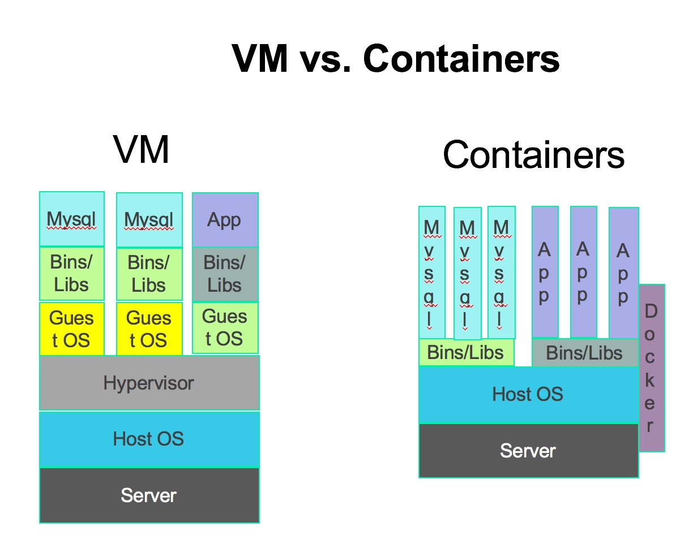

## what are containers? 
 The short answer is that containers decouple software applications from the operating system, giving users a clean and minimal Linux environment while running everything else in one or more isolated "containers".   
The purpose of a container is to launch a limited set of applications or services (often referred to as microservices) and have them run within a self-contained sandboxed environment.    
This isolation prevents processes running within a given container from monitoring or affecting processes running in another container. 

..
## linux namespaces
- Namespaces are a feature of the Linux kernel that partitions kernel resources such that one set of processes sees one set of resources while another set of processes sees a different set of resources.
- limits what you can see
..

 ## What are network namespaces?
 - multiple isolated networking environments running on a single physical host or VM.
 - Each network namespace has its own interfaces, routing tables and forwarding tables.
 
- Generally speaking, an installation of Linux shares a single set of network interfaces and routing table entries. You can modify the routing table entries using policy routing but that doesn’t fundamentally change the fact that the set of network interfaces and routing tables/entries are shared across the entire OS. Network namespaces change that fundamental assumption. With network namespaces, you can have different and separate instances of network interfaces and routing tables that operate independent of each other.

 
 ## difference between virtual machine and containers

 - containers run on host machine
 - Virtual machine provide complete isolation in terms of having its own processes, networking, users, etc., which are separate from the host system and other guest systems that may be running alongside it and not visible on the host system or vice-versa.
-

- containers can be customized and built to whatever specification is desired, and can be used in most part the way a virtual machine is used, 
- virtual machines can be built to whatever specification is desired with packages pre-installed and configured, of any number of operating systems and operating system vender variants and saved as an image.
-
- containers differ from virtual machines is that a guest operating system is not installed
- Operating system installed.

-
- usually consists only the application code and when run, only run the necessary process(es) that one uses the container for
- Contain a set of processes a operating system does
-
- uses host's resources
- require a set of resources specified to it and does not use resources of host.

-
- One kernal only used.
- multiple kernals used

